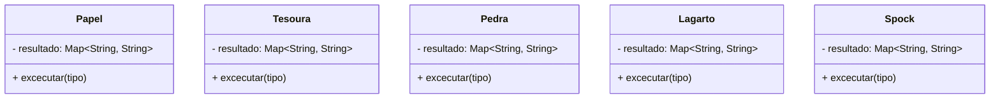
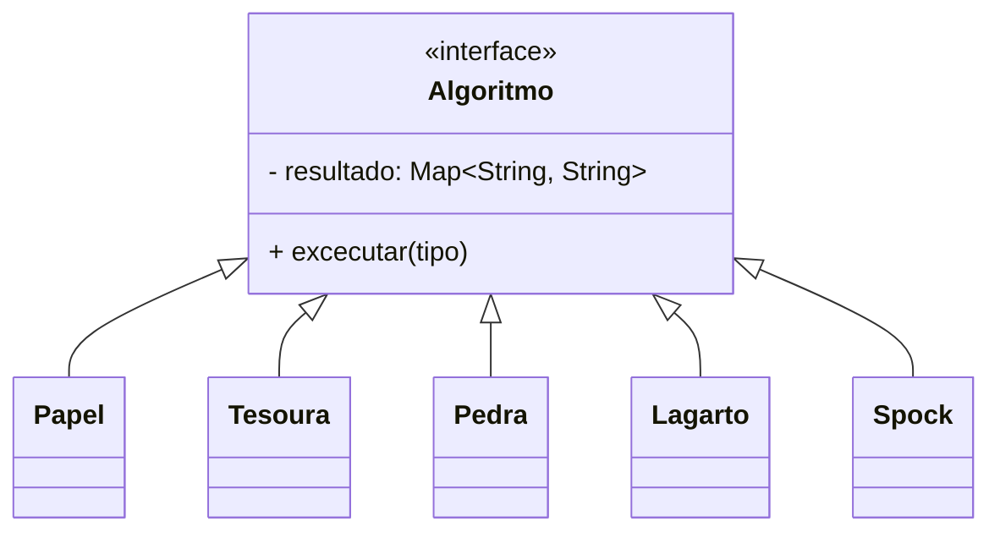

# Resolução utilizando Orientação a Objetos e Design Patterns

Para a resolução desta versão, iremos utilizar a P.O.O. Iremos remover as regras de negócio diluídas na classe Main e distruir reponsabilidades com base em boas práticas de programação orientada a objetos.

## Step 1 - Abstração de Classes

Com base na resolução estruturada, percebemos que cada tipo de joagada possui um série de validações para realizar; dentre elas podemos abstrair inicialmente as classes:
* Papel;
* Tesoura;
* Pedra;
* Lagarto;
* Spock.

Cada uma destas classes terá sua prórpia validação, a validação leva em consideração um tipo especifico.



# Step 2 - Melhoria na abstração

Todas as classes compartilham o mesmo atributo e método, logo elas podem ser herdadas de uma classe base.



Utilizando a herança com a utilização da classe base Algoritmo, poderemos garantir que os algoritmos possam ser substiuidos a qualquer momento na aplicação por eles fazerem parte da mesma família.

# Step 3 - Implementação dos Algoritmos com as regras de negócio

## Classe base para os Algoritmos

> Esta classe irá transmitir às classes herdeiras seus atributos e a interface para a implementação das regras de negócio.

1. Crie classe abstrata Algoritmo no pacote `domain`.

```java
package br.com.fatecararas.domain;

import java.util.HashMap;
import java.util.Map;

public abstract class Algoritmo {

    protected final String KEY = "resultado";

    protected String valor;

    protected Map<String, String> resultado = new HashMap<>();
    public abstract Map<String, String> executar(Tipo pTipo);
}

```

> Neste ponto devemos implementar separadamente os algoritmos em suas respectivas classes, conforme o exemplo da classe Papel no trecho abaixo.

2. Crie as classes para e implemente os algoritmos individualmente.

```java
package br.com.fatecararas.domain;

import java.util.Map;

public class Papel extends Algoritmo {

    @Override
    public Map<String, String> executar(Tipo pTipo) {
        switch (pTipo) {
            case PAPEL -> valor = "Empate. Papel empata com papel!";
            case TESOURA -> valor = "Perdeu! Tesoura corta o papel!";
            case PEDRA -> valor = "Ganhou! Papel embrulha o papel!";
            case LAGARTO -> valor = "Perdeu! Lagarto come o papel!";
            case SPOCK -> valor = "Ganhou! Papel refuta o Spock!";
            default -> valor = "Empatou! Opção inválida!";
        }

        resultado.put(KEY, valor);
        return resultado;
    }
}
```

> Cada classe deverá possuir sua própria implementação.

# Step 4 - Uso do Padrão Strateggy

## To be continue...
